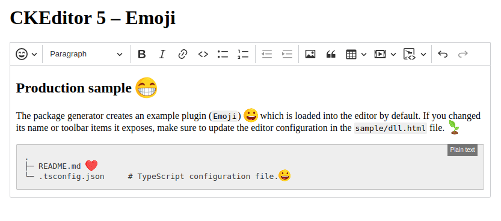

# @linhx/ckeditor5-emoji

Inserting custom emoji from Image Sprites.



## Usage

```shell
npm i @linhx/ckeditor5-emoji
```

[Installing plugins](https://ckeditor.com/docs/ckeditor5/latest/installation/getting-started/installing-plugins.html)

### Style and Emoji sprite

```javascript
import '@linhx/ckeditor5-emoji/theme/emoji.css';
```

Copy `@linhx/ckeditor5-emoji/theme/emojis.png` to your public assets folder, so that the emoji sprite can be accessed through `yourdomain.com/emojis.png`. If not, you have to modify the css file `@linhx/ckeditor5-emoji/theme/emoji.css` to specify the emoji sprite url.

### Custom your Emoji sprite

If you want to use your Emoji sprite:

1. Config plugin

    ```javascript
    {
        emoji: {
            tag: string, // your html tag name of emoji element
            class: string, // your prefix css class of emoji, default is "em"
            groups: Map<string, Array<{key: string, name?: string}>>, // Map of groups of emojis, e.g. { people: [{ key: 'grinning', name: 'Grinning' }] }, the emoji keys should be matching with your css classes.
        }
    }
    ```

2. Write your emoji CSS file, check `theme/emoji.css` for more information.

## TODO

- [ ] single image emoji
- [ ] add tests

======================

This package was created by the [ckeditor5-package-generator](https://www.npmjs.com/package/ckeditor5-package-generator) package.

## Table of contents

* [Developing the package](#developing-the-package)
* [Available scripts](#available-scripts)
  * [`start`](#start)
  * [`test`](#test)
  * [`lint`](#lint)
  * [`stylelint`](#stylelint)
  * [`dll:build`](#dllbuild)
  * [`dll:serve`](#dllserve)
  * [`translations:collect`](#translationscollect)
  * [`translations:download`](#translationsdownload)
  * [`translations:upload`](#translationsupload)
* [License](#license)

## Developing the package

To read about the CKEditor 5 framework, visit the [CKEditor5 documentation](https://ckeditor.com/docs/ckeditor5/latest/framework/index.html).

## Available scripts

Npm scripts are a convenient way to provide commands in a project. They are defined in the `package.json` file and shared with other people contributing to the project. It ensures that developers use the same command with the same options (flags).

All the scripts can be executed by running `yarn run <script>`. Pre and post commands with matching names will be run for those as well.

The following scripts are available in the package.

### `start`

Starts a HTTP server with the live-reload mechanism that allows previewing and testing plugins available in the package.

When the server has been started, the default browser will open the developer sample. This can be disabled by passing the `--no-open` option to that command.

You can also define the language that will translate the created editor by specifying the `--language [LANG]` option. It defaults to `'en'`.

Examples:

```bash
# Starts the server and open the browser.
yarn run start

# Disable auto-opening the browser.
yarn run start --no-open

# Create the editor with the interface in German.
yarn run start --language=de
```

### `test`

Allows executing unit tests for the package, specified in the `tests/` directory. The command accepts the following modifiers:

* `--coverage` &ndash; to create the code coverage report,
* `--watch` &ndash; to observe the source files (the command does not end after executing tests),
* `--source-map` &ndash; to generate source maps of sources,
* `--verbose` &ndash; to print additional webpack logs.

Examples:

```bash
# Execute tests.
yarn run test

# Generate code coverage report after each change in the sources.
yarn run test --coverage --test
```

### `lint`

Runs ESLint, which analyzes the code (all `*.ts` files) to quickly find problems.

Examples:

```bash
# Execute eslint.
yarn run lint
```

### `stylelint`

Similar to the `lint` task, stylelint analyzes the CSS code (`*.css` files in the `theme/` directory) in the package.

Examples:

```bash
# Execute stylelint.
yarn run stylelint
```

### `dll:build`

Creates a DLL-compatible package build which can be loaded into an editor using [DLL builds](https://ckeditor.com/docs/ckeditor5/latest/builds/guides/development/dll-builds.html).

Examples:

```bash
# Build the DLL file that is ready to publish.
yarn run dll:build

# Build the DLL file and listen to changes in its sources.
yarn run dll:build --watch
```

### `dll:serve`

Creates a simple HTTP server (without the live-reload mechanism) that allows verifying whether the DLL build of the package is compatible with the CKEditor 5 [DLL builds](https://ckeditor.com/docs/ckeditor5/latest/builds/guides/development/dll-builds.html).

Examples:

```bash
# Starts the HTTP server and opens the browser.
yarn run dll:serve
```

### `translations:collect`

Collects translation messages (arguments of the `t()` function) and context files, then validates whether the provided values do not interfere with the values specified in the `@ckeditor/ckeditor5-core` package.

The task may end with an error if one of the following conditions is met:

* Found the `Unused context` error &ndash; entries specified in the `lang/contexts.json` file are not used in source files. They should be removed.
* Found the `Context is duplicated for the id` error &ndash; some of the entries are duplicated. Consider removing them from the `lang/contexts.json` file, or rewrite them.
* Found the `Context for the message id is missing` error &ndash; entries specified in source files are not described in the `lang/contexts.json` file. They should be added.

Examples:

```bash
yarn run translations:collect
```

### `translations:download`

Download translations from the Transifex server. Depending on users' activity in the project, it creates translations files used for building the editor.

The task requires passing the URL to Transifex API. Usually, it matches the following format: `https://www.transifex.com/api/2/project/[PROJECT_SLUG]`.

To avoid passing the `--transifex` option every time when calls the command, you can store it in `package.json`, next to the `ckeditor5-package-tools translations:download` command.

Examples:

```bash
yarn run translations:download --transifex [API URL]
```

### `translations:upload`

Uploads translation messages onto the Transifex server. It allows for the creation of translations into other languages by users using the Transifex platform.

The task requires passing the URL to the Transifex API. Usually, it matches the following format: `https://www.transifex.com/api/2/project/[PROJECT_SLUG]`.

To avoid passing the `--transifex` option every time when you call the command, you can store it in `package.json`, next to the `ckeditor5-package-tools translations:upload` command.

Examples:

```bash
yarn run translations:upload --transifex [API URL]
```

## License

The `@linhx/ckeditor5-emoji` package is available under [MIT license](https://opensource.org/licenses/MIT).

However, it is the default license of packages created by the [ckeditor5-package-generator](https://www.npmjs.com/package/ckeditor5-package-generator) package and it can be changed.
